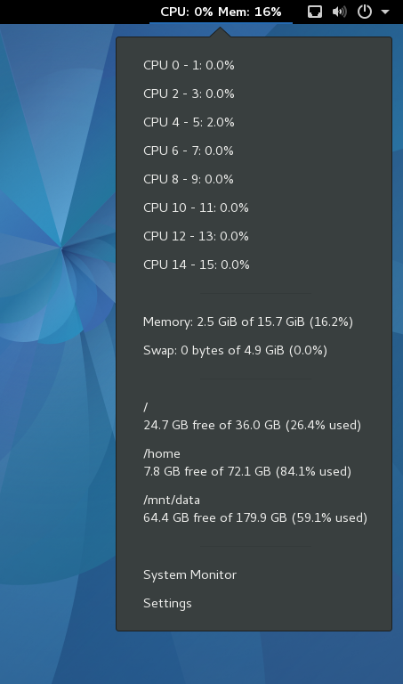

System Info
===========

Installation
------------
Copy the **system-info@M-Mueller.github.com** folder to ~/.local/share/gnome-shell/extensions and activate it through [Gnome Tweak Tool](http://wiki.gnome.org/GnomeTweakTool)

### Compatible with Gnome Shell:
- 3.18
- 3.20
